# KUET-BANK
KUET BANK is mobile financial service of a demo bank, that allows a user to conduct financial transactions via the Internet. 
## Features
* Login system via email address and phone number.
* Register system with email verification and OTP authentication.
* Balance checking system.
* Profile checking and edit system.
* Transfer money from user to user.
* Loan application and approval.
* EMI payment system.
* Customer List, Employee list & profile view.
* Add money and Withdraw.
* View Transaction History.
* Add and remove employees.

# Installation
Download this tools.

1. [ANDROID STUDIO](https://developer.android.com/studio)

## Project Demo
### Flow Chart
From Customers perspective
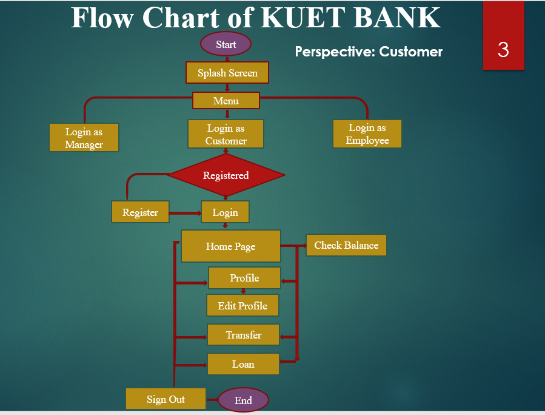

From Employees perspective
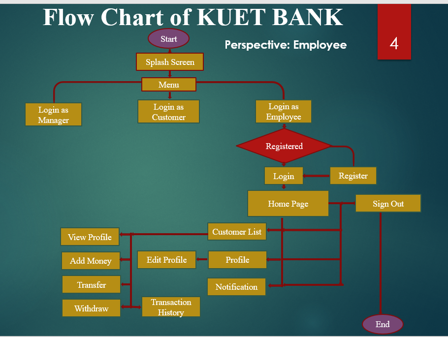

From Admins Perspective
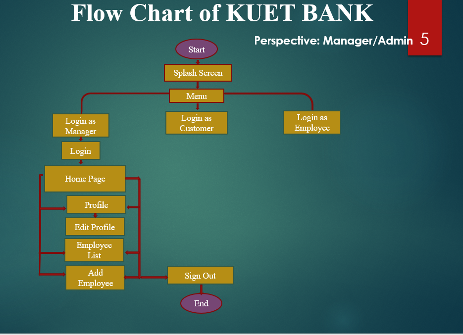

### Screenshots

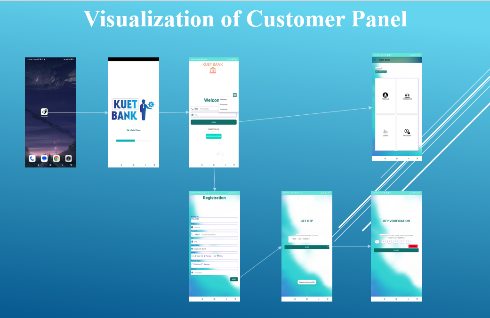

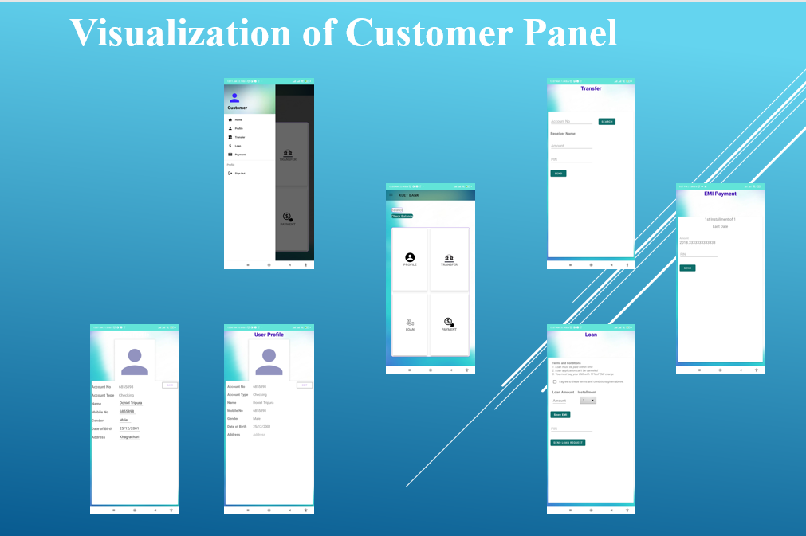

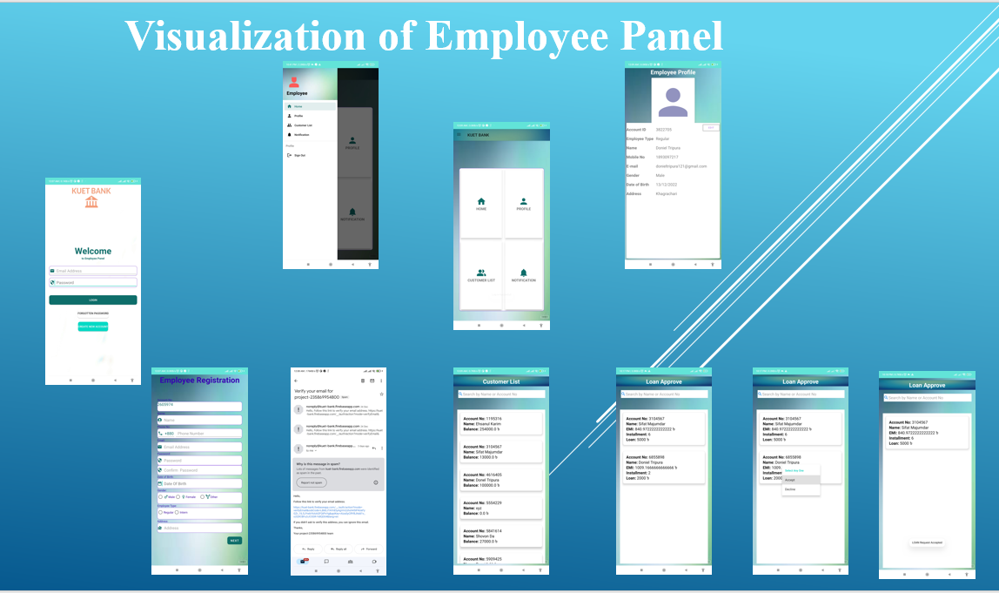

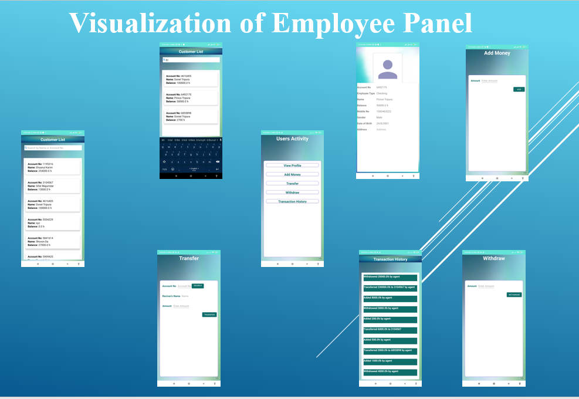

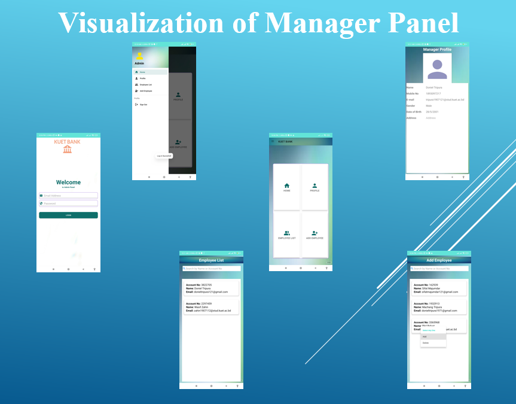

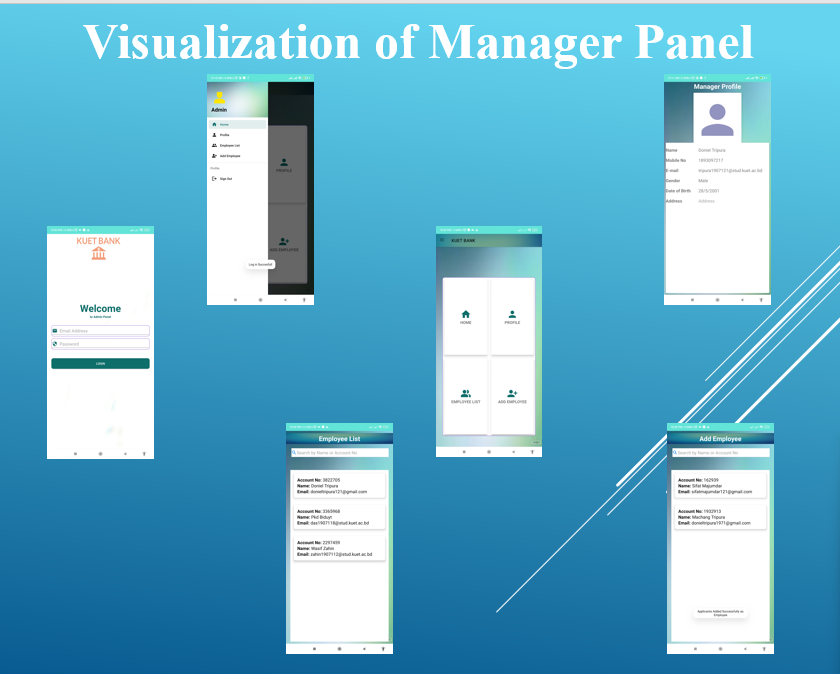

### Firebase Authentication

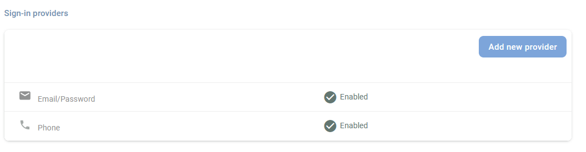

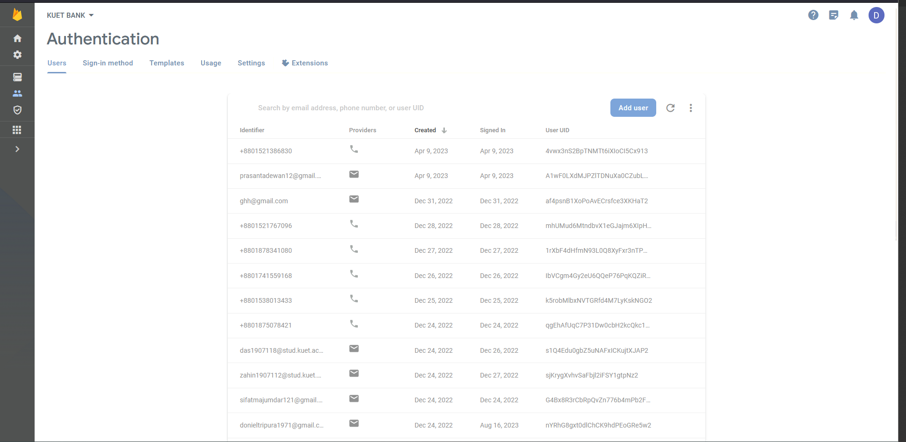

### Firebase Database

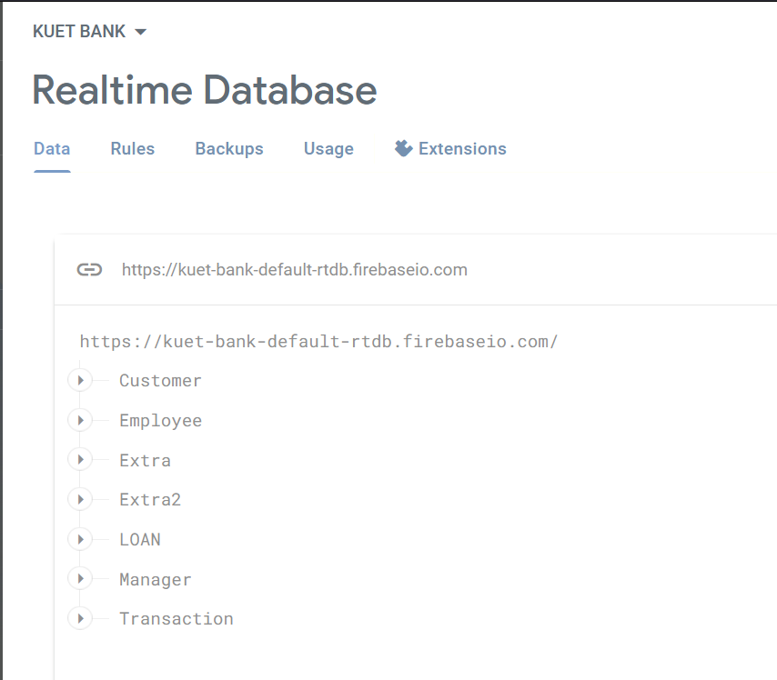

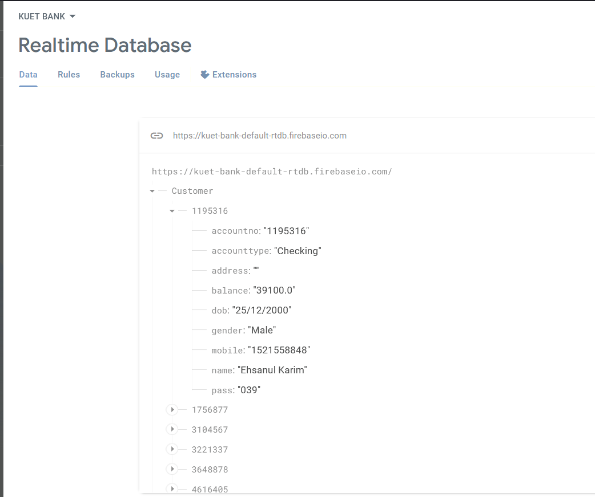
